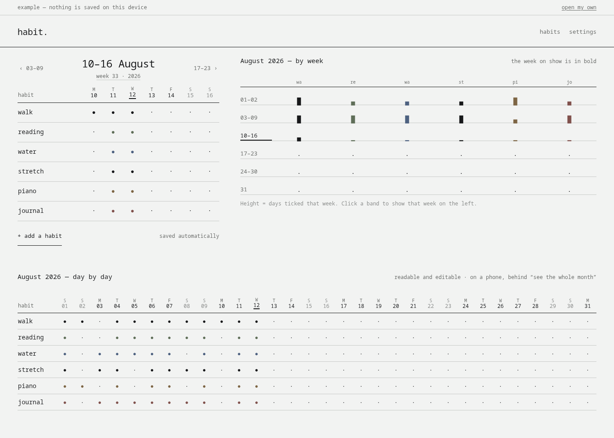
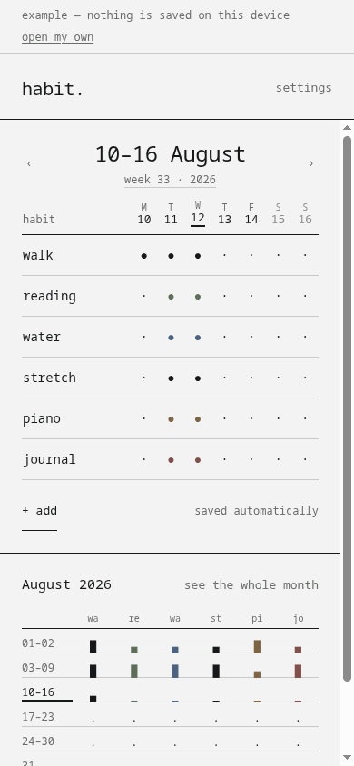
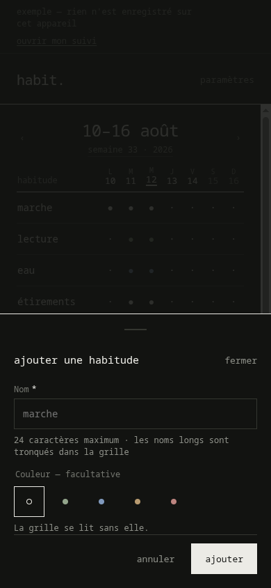

# habit.


**One week. One grid.**

habit. answers a single question: *what did I keep up this week?* No streak to protect, no percentage, no coach. You tick what you did, and the month is still readable in ten years.

No account, no network, no paid tier. Everything lives in your browser's local storage, and the only exchange format is a `habit.json` file that you export and import yourself.

<picture>
  <source
    media="(prefers-color-scheme: dark)"
    srcset="docs/screenshots/app-desktop-dark.png">
  
</picture>

---

## Contents

- [What it is](#what-it-is)
- [What it is not](#what-it-is-not)
- [Why the week](#why-the-week)
- [Screens](#screens)
- [Getting started](#getting-started)
- [Your data](#your-data)
- [Architecture](#architecture)
- [Design system](#design-system)
- [Accessibility](#accessibility)
- [Browser support](#browser-support)
- [Contributing](#contributing)
- [Licence](#licence)

## What it is

|  |  |
|---|---|
| **Unit** | one habit, one day, ticked or not; nothing else is stored |
| **Views** | the week (default) · the month in bands · the month day by day |
| **Vocabulary** | `●` done · `·` not done · `▁ ▄ █` how full a week was |
| **Data** | `localStorage`, `schemaVersion` 1, JSON export and import |
| **Languages** | French, English, or the one your system asks for |
| **Install** | progressive web app, works offline once loaded |
| **Licence** | AGPL-3.0-or-later |

Three layouts, one behaviour. On a phone the week is the page, with the month in bands below it and the day-by-day month one tap away. On a wide screen all three are on screen at once: the week on the left, the month in bands on the right, the day-by-day month underneath.

Seven columns, whatever the number of habits. Adding a habit lengthens the grid; it never narrows it, and nothing ever scrolls sideways in the week view.

## What it is not

- no streak, no chain to keep unbroken
- no percentage, no score, no "best habit"
- no badge, no level, no reward, no celebration
- no notification, no reminder, no nudge
- no goal, no target, no coaching
- no account, no sync, no sharing with anyone
- no tracker, no analytics, no advertising
- no emoji, anywhere

A day left unticked is not a failure. It is a day left unticked.

## Why the week

A thirty-one-day month does not fit on a phone. You either shrink every cell to a three-pixel dot, or you scroll the grid sideways and never see the whole of it. Both make the grid harder to read than the thing it describes.

A week always fits: seven columns, at any number of habits, at any screen width. The month is not lost for that. It is read below the week, one band per calendar week, four stroke heights for how full each was. Tap a band and that week opens above. The exact month, day by day, is one tap further, and editable there too.

The bands are real calendar weeks, not slices of seven days counted from the 1st. That matters: a band you tap has to open the week it describes, and the band for the week on show has to be the right one.

## Screens

| | |
|---|---|
|  |  |
| The week, then the month in bands. | Add a habit: a name, an optional colour. |

## Getting started

Node 20.19+ or 22.12+.

```bash
npm install
npm run dev        # http://localhost:5173
```

| Script | What it does |
|---|---|
| `npm run dev` | development server |
| `npm run build` | typecheck, then production bundle |
| `npm run preview` | serve the built bundle |
| `npm run typecheck` | `tsc --noEmit` |
| `npm test` | the whole suite, once |
| `npm run test:watch` | the suite, watching |
| `npm run icons` | regenerate the icons from the frozen outlines |

`/app?demo=1` opens the app filled with six habits over eight weeks, without writing anything to the device. It is the fastest way to see a change in context.

## Your data

Everything is in `localStorage`, under the single key `habit.v1`, in exactly the format the export produces. What the app reads is what comes out of it:

```json
{
  "schemaVersion": 1,
  "data": {
    "habits": [
      {
        "id": "…",
        "name": "walk",
        "color": null,
        "position": 0,
        "createdAt": "2026-08-01",
        "archivedAt": null
      }
    ],
    "completions": [{ "habitId": "…", "date": "2026-08-12" }]
  },
  "settings": {}
}
```

A day that is not ticked is not written down. Absence is the "not done" state, so a month you never opened costs nothing.

**Export** downloads `habit-YYYY-MM-DD.json`. **Send to** hands the same file to the device's native share sheet when it can take one, and falls back to a download. **Import** validates the schema before anything is touched, then asks whether to merge or replace. Merging attaches habits of the same name and never overwrites a cell you already ticked. A malformed habit is dropped on its own rather than failing the whole import.

Clearing the site data deletes everything, permanently. That is the trade for having no server. Export from time to time.

## Architecture

```
src/
├── lib/          pure logic — no React, no DOM, no window
│   ├── types.ts      the model: Habit, Completion, Settings
│   ├── format.ts     dates in local time, never through UTC
│   ├── week.ts       weeks, month bands, density
│   ├── habits.ts     tick, reorder, archive, delete
│   ├── io.ts         parse, serialise, merge, download, share
│   ├── storage.ts    the single localStorage key
│   └── sample.ts     the example data, computed from today
├── state/        one store, persisted on every change
├── i18n/         fr.ts is the reference, en.ts its typed mirror
├── components/   the shared design-system components
├── app/          the app: grid, month summary, sheets
├── site/         the presentation site
└── styles/       tokens, base, components, app, site
```

`src/lib/` is pure by rule, which is why it carries most of the tests: the logic that can be wrong is tested without a browser. React in `lib/` means the logic is in the wrong place.

Dates are stored as `YYYY-MM-DD` and built from local date parts. Never `toISOString()`: it switches to UTC and moves every tick after 22:00 to the next day anywhere east of Greenwich.

`localStorage` rather than IndexedDB: ten habits ticked every day for a year fit in a few hundred kilobytes, the API is synchronous — so there is no loading state on open — and the stored format stays the file format, readable by eye.

## Design system

The "famille ." 1.2.0 system, shared with the other `.` micro-apps: monospace, right angles, two greys and an ink, no illustration, no shadow, no emoji. See `docs/Design System v1.2.dc.html`.

Every value comes from a token in `src/styles/tokens.css`. A hard-coded colour, size, duration or spacing in a component is a conformance defect.

Habit colours are the one addition habit. makes to the family palette. They are never load-bearing: the full dot against the middle dot already says the state, a setting hides them entirely, and the grid reads the same either way.

Mock-ups live in the Claude Design project *habit — Maquettes v2 (semaine)*.

## Accessibility

The grid is a real `<table>`: day columns and habit rows are actual headers, so a screen reader can walk it in both directions. Each cell is additionally a toggle button named in full — "walk, 12 August 2026, done" — because tabbing through does not read the headers.

- 44 × 44 minimum touch targets, everywhere, including in the month view
- a visible 2 px focus ring, and focus trapped in dialogs then given back
- arrows change week, `T` returns to the current one, `Escape` closes any sheet
- colour is never the only carrier: weekends dim *and* keep their day initial, today is underlined rather than tinted
- `prefers-reduced-motion` removes every transition

Changing week from the keyboard keeps the focus on the same weekday. The cells are keyed by column rank, not by date, so React reconciles them in place.

## Browser support

The last two versions of Chrome, Edge, Firefox and Safari, desktop and mobile. The build targets ES2022 and CSS for Chrome 111 and up. `:has()`, `color-mix()` and `100dvh` are used without fallback.

Web Share is used when the device offers it, and falls back to a download when it does not.

## Contributing

Read [CONTRIBUTING.md](CONTRIBUTING.md). It starts with the two rules that turn down most pull requests, so it is worth the two minutes before writing code.

Everyone taking part follows the [Code of Conduct](CODE_OF_CONDUCT.md). Vulnerabilities go through [SECURITY.md](SECURITY.md), never a public issue.

## Licence

[AGPL-3.0-or-later](LICENSE). You may use, study, modify and redistribute this software; any modified version you make available to others must be available under the same terms, source included.
